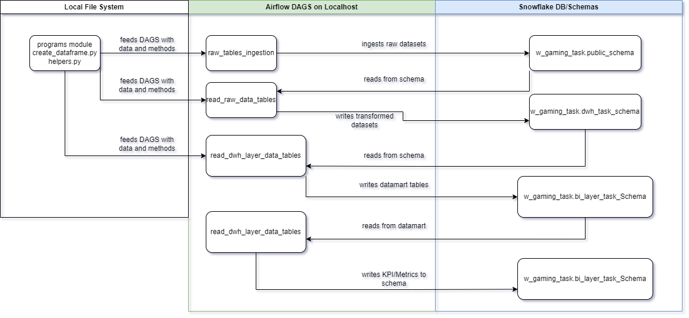
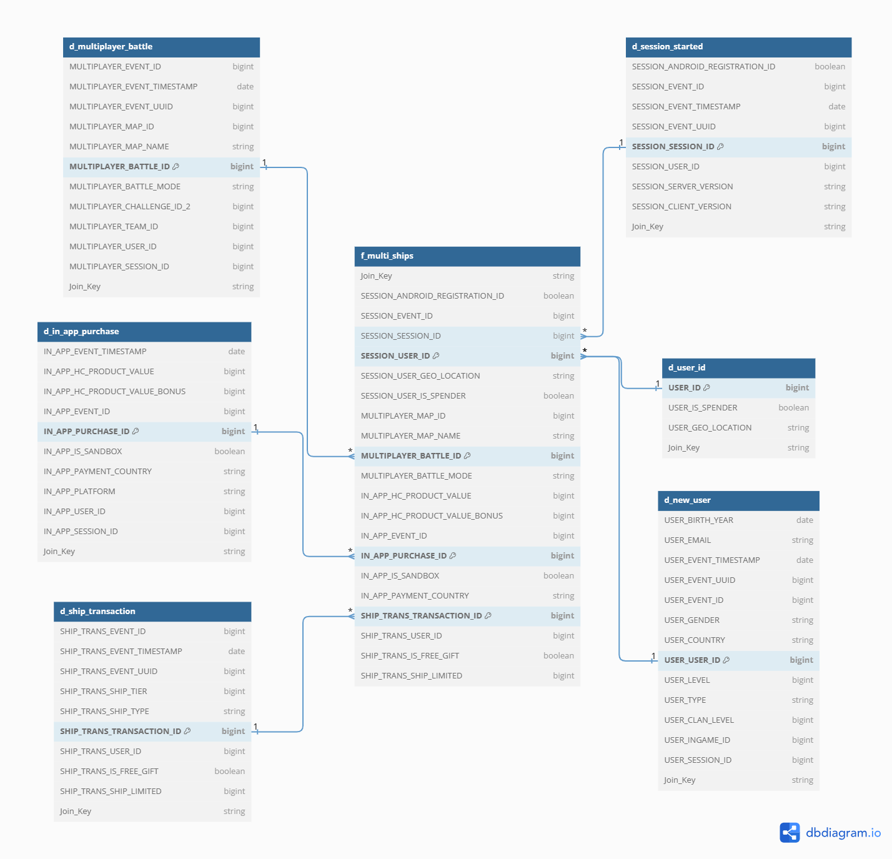

# Data_engineering activites by AIRFLOW and Snowflake
This Repo contains activities related to ETL, data warehouse creation and advanced analytics by Airflow Dags (SQL and Python used as script)

# Task:
There are table definitions which has structure of source tables without any data sample only DDL sql script is available and can be found at files with name 'test_tables 1.sql'.
Tables belongs to gaming domain on app user and game activities

* IN_APP_PURCHASE_LOG_SERVER (Covers user item purchasing data)
* MULTIPLAYER_BATTLE_STARTED (Covers multiplayer battle related data)
* LOGIN (Covers user login data to app)
* NEW_USER (Covers new users user data)
* SESSION_STARTED (Covers session data when user created session)
* SHIP_TRANSACTION_LOG (Covers in game ship buy-purchase-trade data from users items)

# Current Stage:
Based on DDL sql script shared, with using python faker package some fake data holding source tables created with notebook called "Bronze_Layer_Notebook".
Further steps applied on mentioned source tables for further steps.

# Target Stage:
Intention is to create snowflake schemas and populate them with transformed data. All tables created on transformations will be saved to Snowflake schemas)
* PUBLIC schema will hold ingested tables as raw data format
* DWH_TASK schema will hold cleaned and relatively normalized tables as close as It can get to 3NF
* BI_LAYER_TASK schema will hold analytics datawarehouse formatted tables and aggregated views as business requirements mentioned below.
  * All metrics are requested to be calculated by time periods required as Daily,Monthly and Weekly (Prefilters final fact table before metrics calculated)
For to reach target stage from current stage 4 Airflow dags created as named
* raw_tables_ingestion (Ingestion to PUBLIC Schema)
* read_raw_data_tables (Created Normalized Tables -  Deduplicated tables by unique value holding fields)
  * IN_APP_PURCHASE_DF_DWH Table
  * LOGIN_DF_DWH Table
  * Multiplayer_Battle_DF_DWH Table
  * New_user_DF_DWH Table
  * Session_started_DF_DWH Table
  * Ship_transaction_DF_DWH Table
  * User_id_DF_DWH Table (Created with anti join of new_user table and session_started table
* read_dwh_layer_data_tables & kpi calculation
  * (Created Data Model for BI tool (Star Schema)) and (Table/Views holding Metrics/KPIs defined below)

# Flow Diagrams (Shows steps applied on DAGS)

# Golden Layer Datamodel (Some columns hidden due to downsize schema view)

## All metrics calculations located on kpi_calculation.py DAG file
## General Metrics
* Active Users: Unique User count exists on f_multi_ships table based on field named "Session_User_Id"
* New Users: Unique User count exists on d_new_user dimension table based on field named "User_User_ID"
* Revenue Sum: Total revenue sum from IN APP user purchasements calculated based on f_multi_ships table`s field "IN_APP_USD_COST" sum(IN_APP_USD_COST)
* Spender Users: Count of User_Is_Spender field from d_user_id dim table
* ARPU: Revenue per active user, calculated by division of Total Revenue to Active User Number
* ARRPU: Revenue per spender users, calculated by division of Total Revenue to Spender User Number
* 1 Day Retention Rate: Division of game played new user number to all new user number for last 1 day
* 3 Day Retention Rate: Division of game played new user number to all new user number for last 3 day
* 7 Day Retention Rate: Division of game played new user number to all new user number for last 7 day
* 7 Day Conversion Rate: Division of item purchased new user number to all new user number for last 7 day

## In game ship related metrics
* Ships owned by everyuser everyday: Ships count that get into transactions this view will show that count as grouped by user_id, daily timestamp and ship name
* Daily ships popularity: Ships rank by purchase count daily / Ships rank by sold count daily

## User transactions overview
* Amount of multiplayer battles before first purchase date of users: User battle participation count before their first purchase date
* Amount of logins before first purchase date of users: User login count before their first purchase date
* Amount of days before first purchase date of users: User day count before their first purchase date (Between their registration date and first purchase date)
* Daily revenue per user: IN_APP item cost sum per User -- IN_APP_USD_COST field sum grouped by USER_ID for last 1 day
* Weekly revenue per user: IN_APP item cost sum per User -- IN_APP_USD_COST field sum grouped by USER_ID for last 7 day
* Monthly revenue per user: IN_APP item cost sum per User -- IN_APP_USD_COST field sum grouped by USER_ID for last 30 day

## Battle analysis
* New users participation in battles since 1/3/7/14 days since registration: User table with battle participation count as daily
* Active users battle participations of all times: User table with battle participation count as daily

# Activation of DAGS
Dags are dependent to each other as per their queue on ETL process, When Ingestion DAG runs as daily scheduled rest also runs by following.
